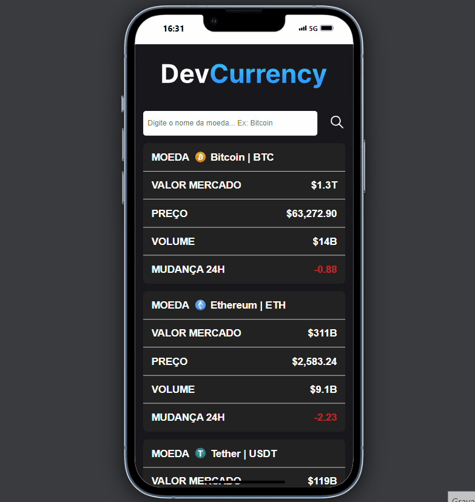

<h1 align='center'>Criptoapp</h1>
A website that displays information about cryptocurrencies in a table format. Allows sorting by market value, price in dollars, 24-hour variation, and traded volume, as well as searching for specific cryptocurrencies.

## View the Application 🌎
[Criptoapp](https://criptoapp-ten.vercel.app/)

## Desktop Version 🖥️
  

## Mobile Version 📱

## License 📄

This project is licensed under the [MIT License](LICENSE).

You are free to use, modify, and distribute this software for personal and commercial purposes, as long as the original license and copyright notice are included. There is no warranty for the code provided, and the author is not liable for any issues arising from the use of this software.